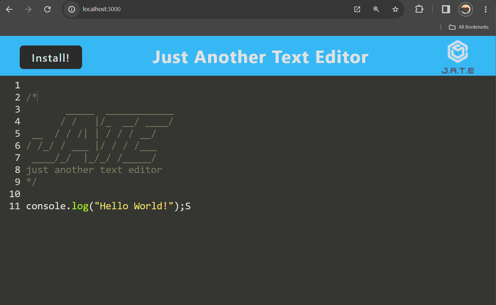

# Text-Editor  

## Description

A simple PWA text editor.

## Table of Contents

- [Installation](#installation)
- [Usage](#usage)
- [Screen-Shot](#screen-shot)
- [License](#license)
- [Contributing](#contributing)
- [Questions](#questions)

## Installation

Before cloning this repository, please ensure that you have Node.js installed on your system. Once Node.js is installed, follow these steps:
```bash
npm run build

npm run start:dev
```

## Usage

 [Website Link](https://tech-blog-ct-4cf92c1dd72a.herokuapp.com/)

## Screen-Shot



## License

This project is licensed under the MIT License. See the [MIT License](https://github.com/charleswt/Text-Editor/blob/main/LICENSE) file for details.

## Contributing

This project was developed by [Charles Tiffany](https://github.com/charleswt/).

## Questions

If you have any questions or suggestions, please email me at charleswtiffany@gmail.com.